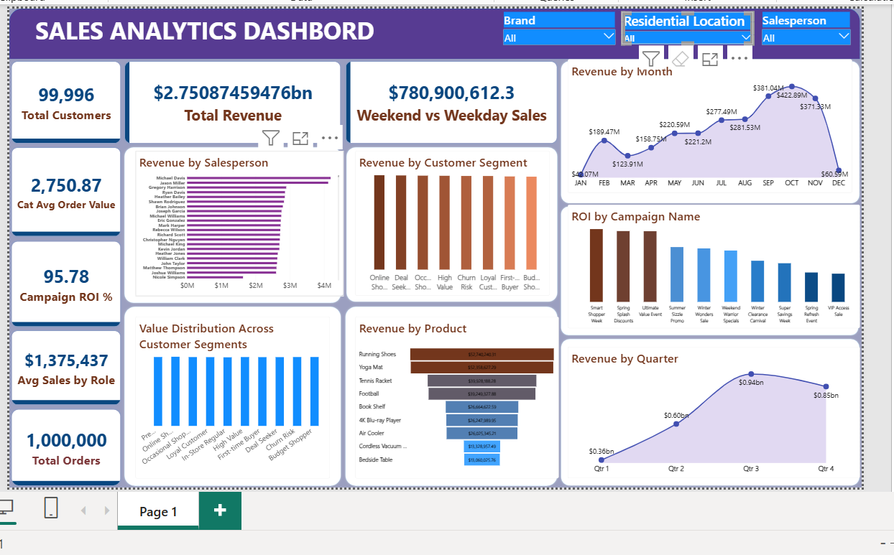

# 🛒 Retail Sales Analytics | Power BI Dashboard

**Where does a $2.75B retail business make its money, and what really drives its sales?**
An end-to-end Power BI project: 7 raw CSV files → Power Query → star-schema data model → 14 focused DAX measures → an interactive, optimized sales dashboard.


---

## 📸 Dashboard Preview



---

## 1. 🔍 Overview

I built this dashboard to analyse **one year of sales for a multi-store retailer**. The data covers **1,000,000 transactions** from **2 Jan to 26 Dec 2024**, across **500 stores in 50 US cities**, **210 products**, **2,000 salespeople**, **100,000 customers** and **50 marketing campaigns**.

The report is a **one-page Sales Overview** dashboard:

| Area | What it shows |
|---|---|
| **KPI cards** | Total Revenue, Total Orders, Total Customers, Average Order Value, Campaign ROI %, Average Revenue per Salesperson, Weekend Sales |
| **Trends** | Revenue by Month and Revenue by Quarter |
| **Marketing** | ROI by Campaign (top 10 campaigns) |
| **Customers** | Revenue by Customer Segment and customer value by segment |
| **Products and staff** | Revenue by Product (funnel) and Revenue by Salesperson |

Slicers for **Brand, Customer City and Salesperson Role** filter the whole page in one click.

After building it, I **optimized the model**: the file went from **39.8 MB to 14.9 MB** (about **63% smaller**) with every visual still working.

---

## 2. ⚠️ Business Problems

The business had a million sales records but no single view of performance. Management needed answers to:

- 💰 **How are we performing?** How much revenue did we make, from how many orders and customers?
- 📈 **When do we sell?** How does revenue move by month and quarter, and why?
- 📣 **Is marketing paying off?** Which campaigns return the most per dollar, and does a bigger budget bring more sales?
- 👥 **Who are our customers?** Is each customer segment really worth something different?
- 🏬 **Where do we sell?** Which cities and stores perform best?
- 🧑‍💼 **Who sells best?** Which salespeople and roles bring in the most revenue?
- 📦 **What do we sell?** Which categories, brands and products drive revenue?

---

## 3. 🎯 Objectives

1. Measure **total revenue, orders, customers and average order value** for 2024.
2. Track **monthly and quarterly trends** and explain the peaks and dips.
3. Measure **campaign ROI** and test whether budget size drives revenue.
4. Compare **customer segments, product categories, stores and salespeople**.
5. **Validate every KPI** against the raw data before trusting it.
6. Keep the model **lean and fast**, with only the columns and measures the report uses.
7. Give management a **clear, interactive dashboard** and practical **recommendations**.

---

## 4. 🗂️ Dataset

| Item | Details |
|---|---|
| **Source** | Retail sales dataset, 7 CSV files (`fact_sales_denormalized.csv` plus six dimension files) |
| **Rows** | **1,000,000** sales transactions (one row per sale), plus 103,126 rows across the dimension tables |
| **Columns** | **9** in the sales fact table; **32** across all 7 tables after cleaning and optimization |
| **Coverage** | 2 Jan – 26 Dec 2024 (360 trading days), 500 stores in 50 US cities |
| **Data model** | Star schema: 1 fact table, 6 dimension tables and a dedicated `Measures Table` (14 DAX measures) |
| **File size** | **14.9 MB** (down from 39.8 MB) |

**The 7 tables**

| Table | Type | Rows | Columns | What it holds |
|---|---|---|---|---|
| `fact_sales_denormalized` | Fact | 1,000,000 | 9 | One row per sale: 5 keys, date, amount, segment, category |
| `dim_customers` | Dimension | 100,000 | 3 | Customer key, home city, segment |
| `dim_salespersons` | Dimension | 2,000 | 3 | Salesperson key, name and role |
| `dim_stores` | Dimension | 500 | 1 | Store key (links each sale to its store) |
| `dim_dates` | Date | 366 | 8 | Calendar for 2024: year, quarter, month, month name, weekday |
| `dim_products` | Dimension | 210 | 4 | Product, category, brand |
| `dim_campaigns` | Dimension | 50 | 4 | Campaign ID, name and budget |

---

## 5. 🛠️ Methodology

**Step 1: Data preparation (Power Query)**
- Imported the 7 CSV files, promoted headers and set an explicit data type for every column.
- **Customers:** removed names, email and customer IDs, so no personal data sits in the report.
- **Sales:** converted `sales_date` from date-time to a date so it joins to the calendar.

**Step 2: Data modelling**
- Built a **star schema** with `fact_sales_denormalized` in the centre and **six one-to-many, single-direction relationships** to customers, products, stores, salespeople, campaigns and dates.
- Kept all **14 DAX measures** in a dedicated **Measures Table**, separate from the data.

**Step 3: DAX measures**
- Core KPIs: Total Revenue, Total Orders, Total Customers, Customer Lifetime Value, Category Average Order Value.
- Campaigns: Campaign Revenue, Campaign Budget, Campaign ROI %.
- Ranking and segments: Salesperson Rank (RANKX) with a Top 10 flag, Revenue by Segment, Average Sales by Role, Customers by Location, Weekend vs Weekday Sales.

```dax
Total Orders = COUNTROWS ( fact_sales_denormalized )

Total Customers = DISTINCTCOUNT ( fact_sales_denormalized[customer_sk] )

Campaign ROI % = DIVIDE ( [Campaign Revenue] - [Campaign Budget], [Campaign Budget] )
```

**Step 4: Dashboard design**
- Built the Sales Overview page with KPI cards, area, line, column, bar, funnel and combo charts, and three slicers.

**Step 5: Data validation**
- Reconciled the headline KPIs to the raw data: **1,000,000** sales (one row per order) and **$2,750,874,594.76** total revenue.
- Every key in the sales table matches a row in its dimension table (no orphan records).
- Validation **found four issues**. Two are now resolved; two are **not yet fixed** in the current version of the report:

| Issue found | What it affected | Status |
|---|---|---|
| The `Distinct Customers` measure counted sales rows (1,000,000), not customers | `Revenue per Customer` returned the average order value instead of revenue per customer | ✅ Resolved: incorrect measure removed. Customer counts now come from `Total Customers` (distinct `customer_sk`) |
| `Churn Risk Customers` had no segment filter | `Churn Risk %` showed **100%** | ✅ Resolved: incorrect measure removed |
| Campaign keys in the sales file do not line up with the campaign table: **48 of 50** point to the wrong campaign, and only **39.5%** of sales fall inside their campaign's dates | Campaign names on the ROI by Campaign chart | ⏳ Not yet fixed. Planned fix: remap the keys in Power Query |
| 21 salesperson names are shared by 44 different people | Salesperson ranking merges people with the same name | ⏳ Not yet fixed. Planned fix: rank on a unique salesperson key |

All figures in this README come from the raw data, so they are not affected by these issues.

**Step 6: Model optimization**
- Removed **unused high-cardinality columns**, mainly the two 1-million-value sales ID columns (`sales_id`, `sales_sk`), plus the hour, store type, customer name and ID, and unused store, product, salesperson and campaign columns.
- Rewrote `Total Orders` as `COUNTROWS(fact_sales_denormalized)`, so it no longer needs an ID column.
- Removed **46 measures** that no visual used, going from 60 to **14** measures.
- Result: file size cut from **39.8 MB to 14.9 MB (about 63% smaller)**, with **no visual lost**.

---

## 6. 📊 Key Metrics

| KPI | Value |
|---|---|
| 💰 Total Revenue | **$2.75B** ($2,750,874,594.76) |
| 🧾 Total Orders | **1,000,000** |
| 👥 Unique Customers | **99,996** (of 100,000 on file) |
| 🛍️ Average Order Value | **$2,750.87** (median $2,750.53) |
| 👤 Customer Lifetime Value (revenue per customer) | **$27,509.85** |
| 🔁 Orders per Customer | **10.0** |
| 🏆 Best Quarter | **Q3: $940.06M** (34.2% of the year) |
| 📅 Best Month | **October: $422.89M** (15.4% of the year) |
| 📈 Second-Half Share of Revenue | **65.2%** |
| 📣 Total Campaign Budget | **$28.42M** across 50 campaigns |
| 🏬 Average Revenue per Store | **$5.50M** (range $5.15M – $5.85M) |
| ⚡ Model File Size | **14.9 MB** (down 63% from 39.8 MB) |

---

## 7. 🧰 Skills and Tools

| Tool / Skill | How I used it |
|---|---|
| **Power BI Desktop** | Report design, KPI cards, charts, slicers, Top N filters |
| **Power Query (M)** | CSV import, data types, removing personal and unused columns, date conversion |
| **Data Modelling** | Star schema, one-to-many relationships, dedicated measures table |
| **DAX** | CALCULATE, DIVIDE, COUNTROWS, DISTINCTCOUNT, ALLEXCEPT, ALLSELECTED, FILTER, RANKX |
| **Model Optimization / Performance Tuning** | Finding the biggest columns, removing unused high-cardinality columns and measures, cutting the file by 63% |
| **Data Validation** | Reconciling KPIs to source data, checking keys, duplicates and measure logic |
| **Analysis** | Trend and growth analysis, campaign ROI, segmentation, correlation |
| **Data Storytelling** | Turning sales numbers into clear business actions |

---

## 8. 💡 Insights and Findings

**1. Sales grew strongly through the year.**

| Quarter | Revenue | Share of Year | QoQ Growth |
|---|---|---|---|
| Q1 | $355.46M | 12.9% | — |
| Q2 | $600.53M | 21.8% | +68.9% |
| Q3 | $940.06M | **34.2%** | +56.5% |
| Q4 | $854.82M | 31.1% | -9.1% |

Revenue rose **164%** from Q1 to Q3. **October was the peak month ($422.89M)**, and November fell 12.2% as fewer campaigns were running. January and December are partial months (the data runs 2 Jan – 26 Dec).

**2. Revenue follows campaign activity.**
Daily revenue moves closely with the number of campaigns running that day (correlation **r = 0.75**). There were **no sales at all** on the 6 days with no campaign running.

**3. A bigger budget does not buy more revenue.**
Every campaign brought in between **$54.3M and $55.7M**, whatever its budget ($105,815 to $987,420). So ROI is driven almost entirely by how little a campaign cost, not by how well it sold.

**4. Customer segments do not behave differently.**
All 10 segments, from "High Value" to "Churn Risk" and "Budget Shopper", spend about **$27,400 – $27,600 per customer**. The segment labels do not reflect real buying behaviour.

**5. Store revenue comes from store count, not format or location.**
Every store earns about **$5.5M** (range $5.15M – $5.85M), so a city's revenue is almost exactly proportional to how many stores it has (r = 0.9996).

**6. Categories are evenly balanced.**
All six categories sit between **16.6% and 16.8%** of revenue. Sports & Outdoors leads by a small margin and Clothing is last.

**7. Most of the file size was in two columns the report never used.**
The two unique sales ID columns took up more than half of the data model. Removing them, along with other unused columns and measures, made the file 63% smaller without changing a single number on the dashboard.

---

## 9. ✅ Recommendations

1. 📣 **Keep campaigns running all year.** Sales track the number of live campaigns, and there were no sales on days without one. Plan a steady calendar instead of the drop seen in November and December.
2. 💸 **Shift budget to low-cost campaigns.** Expensive campaigns brought in no more revenue than cheap ones. Cap budgets and test smaller, more frequent campaigns.
3. 🎯 **Rebuild customer segments from real behaviour.** Use recency, frequency and spend (RFM) so "High Value" and "Churn Risk" mean something.
4. 🏬 **Grow through new stores in strong cities.** Revenue per store is almost identical everywhere, so each new store adds about $5.5M.
5. 📅 **Prepare for the Q3 to Q4 peak.** Plan stock and staffing for September to November, the three biggest months.
6. 🛠️ **Apply the two remaining validation fixes** (campaign key remap and a unique salesperson key) before using the campaign ROI and salesperson-ranking views for decisions.

---

## 👤 Author

**Tajudeen Gbenga Rabiu** 
| Data Analyst · Power BI · SQL · Python · Excel

- 💼 LinkedIn: [linkedin.com/in/tajudeen-rabiu-data](https://www.linkedin.com/in/tajudeen-rabiu-data)
- 📧 Email: [tjrabiu.data@gmail.com](mailto:tjrabiu.data@gmail.com)

⭐ If you found this project useful, please star the repository.
